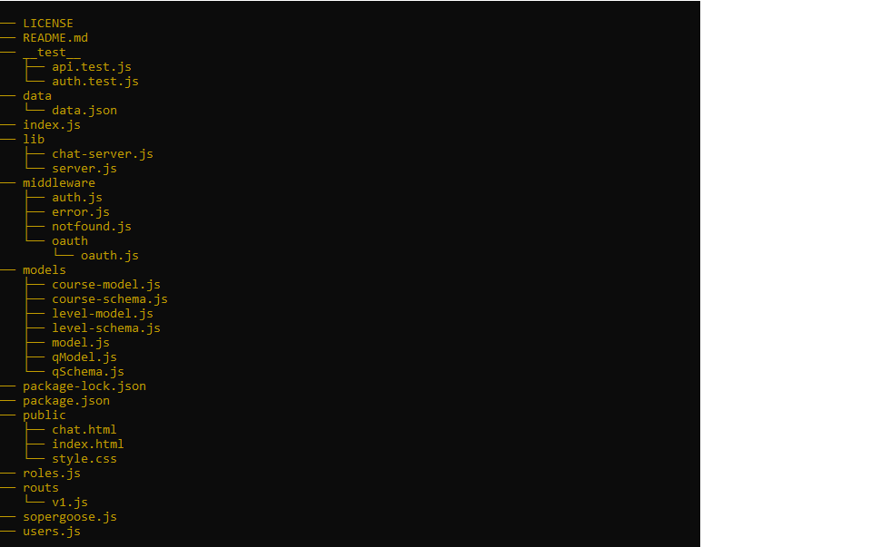
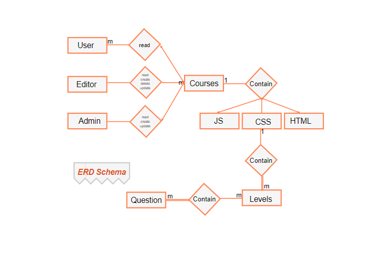
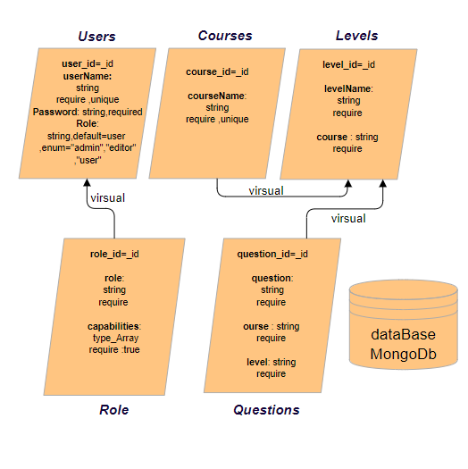
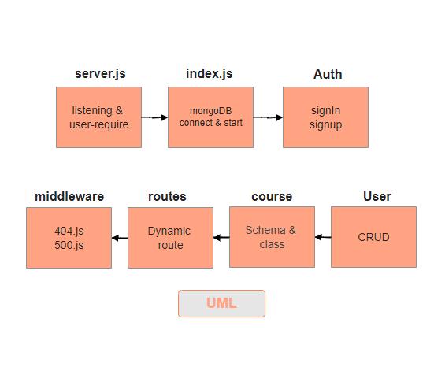
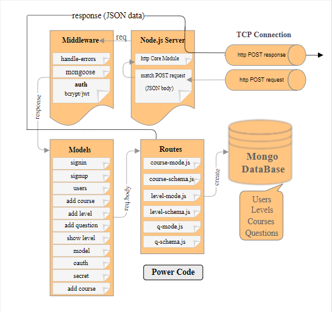

# Code-Power-App

# Power Code Academy

## OverView 

Power Code Academy is an educational website that provides an interactive opportunity to learn different programming languages. We are committed to building a learning experience that allows for creating a user driven online learning experience for the future.

Traditional education is coupled with teaching methods that exist within schools that are no longer prevalent. As a result, many companies work to "disrupt" education by changing the way things work in the classroom and by providing lessons and educational materials online. We take references from modern technology innovators in creating an engaging learning experience from what we have done in the classroom.

This application consists of a API that was written in JS using Visual Studio Code. For manual testing we used the Swagger Inspector tool to check our enpoints. Our application was built to help users take courses in different languages like JS, HTML, and CSS. This application has many course offerings and each new course contains many levels. Each level has several questions related to the specific course. The user has the ability to track the course through different levels, then answer questions that allow the user to know their programming capabilities.

This RESTful API provides the necessary back-end infrastructure and functionality depending on what powers are granted. Depending on your role, you may be able to create, read, update and delete data in our application.


**Application Repository**  --> (https://github.com/401-project-SGON/Code-Academy-Style-App)


## Environment Tools Used:- 
 
1. Visual Studio Code - for code editing
   * NodeJS
   * Express 
   * mongoose
   * superagent
2. Ubuntu
3. MongoDB
4. Swagger
5. Trello

 ***

## Current Version (0.0.1)

The current version of the Power Code application is designed to create, read, update and delete questions.  This allows for iteration to give users the best learning experience.

This API was designed to be extensible so that we can add multiple language courses in the future.

***

## Tree of our project 
 


***
## Auth Routes :-

### signup route :- 
Provide a username, password and a role. We also require secure token access. This route creates a new user by taking a username and password to access our courses and questions in the request.

The token will return just for the user who signs in through our API signin route. They will receive a new token after signing in and can use it to access other routes.

```
router.post('/signup', (req, res) => {
  new User(req.body).save()
    .then(userIn => {
      let token = User.generateToken(userIn);
      res.status(200).send(token);
    });
});
```

### signin route :- 

In this route, we require an authorization header for the user. This header has a username and password to achieve the right authentication. After that, we will return a new token that will be used for user identification. 

```
router.post('/signin', auth ,(req, res) => {
  res.status(200).json(req.token);
});
```


## DataBase Schema Diagram:

### ERD diagram :-
*** 


### MVP Schema Diagram:-
*** 


****

## CRUD 

### Create:POST

In this route we return the all object records in our database as a request body.  After creating the new object, they will return the specific new object and then this record will be added to the database.

```javascript
function create(req,res,next){
  req.model.create(req.body).then(data=>{
    res.status(200).json(data)
  })
}
```

Create a new question to save to our API

```javascript
"_id": "5e4d42274b02920e9beb39db",
"question": "How can you create an object in JavaScript? ",
"answer": "var emp = {name:\" Daniel\",age: 23};",
"level": "level-1-js"
```

### Update:-PUT
This route takes the id of the user as a parameter, which will accept all records including the specific id that is needed to update the request body. After that, the single updated object record will be returned to our database.| 
```
function update(req,res,next){
  req.model.update(req.params.id,req.body).then(data=>{
    res.status(200).json(data)
  })
}
```

Update a question and re-save it to the database

```javascript
"_id": "5e4d42274b02920e9be339db",
"question": "How can you create an array in JavaScript? ",
"answer": "var arr = [];",
"level": "level-1-js"
```

### Read / GetOne :-
In this route we take an id as parameter, then we will return a single object record from the database.

```javascript
function getOne(req,res,next){
  req.model.get(req.params.id).then(data=>{
    res.status(200).json(data)
  })
}
```
Read will return a question from the database

```javascript
"_id": "5e4d42274b02920e9be339db",
"question": "How can you create an array in JavaScript? ",
"answer": "var arr = [];",
"level": "level-1-js"
```

### Read / GetAll :- 
In this route we return an object that will return all object records from the database.

```javascript
function getAll(req,res,next){
  req.model.get().then(data=>{
    res.status(200).json(data)
  })
}
```
Read will return all questions from the database

### Delete :- 
In this route we take an id as a .route parameter to delete a specific record.  After that it will return a message that the item is deleted.

```javascript
function deleteOne(req,res,next){
  let mesg = "item deleted"
  req.model.delete(req.params.id).then(data=>{
    res.status(200).json(mesg)
  })
}
```
Message from deletion:

`item deleted`




## Middleware:

* The express router middleware provides the base routing capabilities
* A custom handle-errors module implements and extends the HTTP-errors npm middleware package
* An auth middleware module leverages two npm modules (bcrypt, jsonwebtoken) and the module to provide user sign-up and user sign-in functionality as well as session authentication/authorization.
* Custom Oauth, Bearer and access control middleware
* The mongoose npm module is used for interaction with the mongo database

Individual resources (user, sign in,signup...) have dedicated dynamic models. These models are the interface between the routers and the mongo database. The dynamic model takes in a request from a route and calls it then returns a response to the route once a request has been processed in the model.

mongoose & model: The dynamic model system leverages the required mongoose client module to create new schemas in the MongoDB database and executes CRUD operations on MongoDB documents. Currently supported resources include:

- user
- editor
- admin
- courses
- levels
- questions




***


## Future Releases
 * Dynamically moving the user from the current level to the next level
 * Save user marks from previous stages
 * Dialogue sessions between users of the same programming language
 * Add exams to evaluate users

***
## Way to contribute

- Leave a comment in Github
- Discuss your advice during application chat 
- Reporting Bugs: Open up an issue through this git repository and select "bug" as the label
- Recommending Enhancements: Open up an issue through this git repository and select "enhancement" as the label
- Issues are reviewed weekly

## Architecture

This API is structured on a Model View Controller(MVC) architecture pattern. The base technologies are node.js server, node.HTTP module, express middleware, and a mongo database. This architecture is currently deployed in the Heroku platform.


## Group Members:-

***
1. Naseem Izzat: (https://github.com/naseem-qa)
2. Sohad Odtallah Al-Qtaitat: (https://github.com/sohadQtaitat)
3. Obada Quran: (https://github.com/obadeh)
4. Goroob Al-Swalqah: (https://github.com/Goorob)


