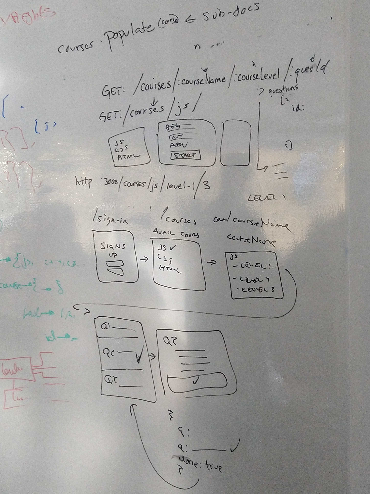
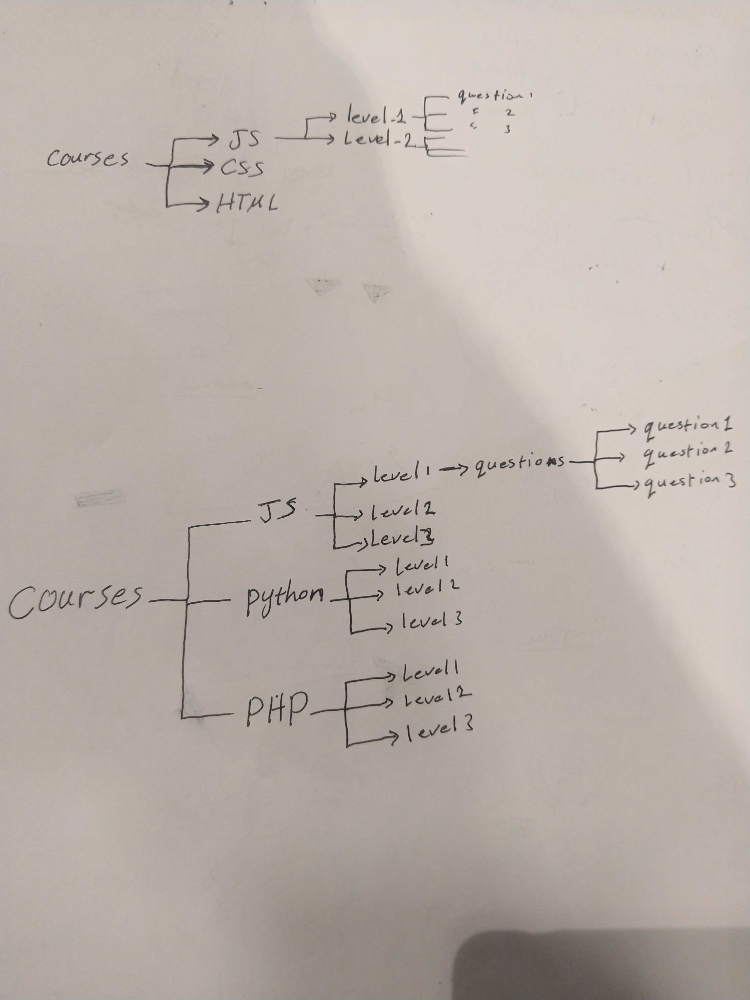

# ***Code Academy Project***
---------------------------------
---------------------------------
## We are deployed on _____

[project url here]

---------------------------------
## Web Application
******

The web application consists of backend was written in js using Visual Studio Code and MONGODB.For testing we used Swagger.

Main idea of our project :
Our project talking about build application which help users to tack courses about some languages like (Js ,Java ,Python ...).The application have many courses and each courses have many levels,each level have numbers of question related to the course name.
The user have an ability to tack the course then answer some questions allow him /her to know their level.

---------------------------------

## Tools Used
1. Visual Studio code 
  - NodeJS
  - Express 
  - mongoose
  - superagent

2. Ubunto
3. Mongodb
4. Swagger
5. Trello
7. bookApp

---------------------------------

## Getting Started

Clone this repository to your local machine.
```
$ git clone https://github.com/401-project-SGON/Code-Academy-Style-App
```
Once downloaded, you can use  Visual Studio 2017 (or greater) to build the web application.
```
cd YourRepo/YourProject
`npm i`
```
Install all dependencies needed for the project.
```
Database
```
Making CRUD by using Mongodb

```
cd YourRepo/YourProject
nodemon index.js
```

---------------------------
## Data Flow (Frontend, Backend, REST API)


---------------------------
## Data Model

### Overall Project Schema


---------------------------


## Authors
- Nassem Izzat
- Gorob Ahamad
- Obada Quran
- Sohad Qtitat

------------------------------
