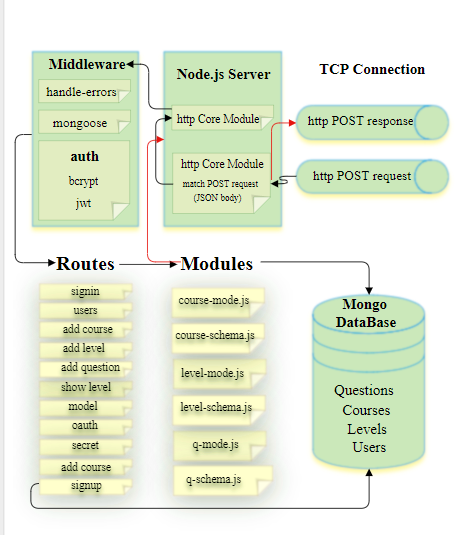

# Power Code Web Site

## Over View 

Code Academy is an educational website that provides an interactive opportunity to learn programming languages. We are committed to building your best learning experience for learning , education and creating an online learning experience for the future.

Traditional education is coupled with teaching methods that exist within schools that have not spoken of centuries ago. As a result, many companies work to "disrupt" education by changing the way things work in the classroom and by providing lessons and educational materials online. We take references from modern technology innovators in creating an engaging learning experience from what we do in the classroom.

The web application consists of back end was written in js using Visual Studio Code and MONGODB. For testing we used Swagger.Our project talking about build application which help users to tack courses about some languages like (Js ,php ,Python).The application have many courses and each courses have many levels,each level have numbers of question related to the course name. The user have an ability to tack the course whit different levels then answer some questions allow him /her to know their programming capabilities .

This REST full API provides the necessary back-end infrastructure and functionality depending on the powers granted to create, read, update and delete data in our application.

## Environment Tools Used :- 
 
1. visual studio code
   * NodeJS
   * Express 
   * mongoose
   * superagent
2. Ubunto
3. Mongodb
4. Swagger
5. Trello
6. Edraw Max-for architecture

 ***
## Current Version (0.0.1)

The current version of power code application is designed to create, read, update and delete the questions then return the score to user.

This API was designed to be extensible, so that we can add multiple code language courses that supported in the future.

***
## Future Releases
 * Dynamically moving the user from the current level to the next level
 * Save user marks from previous stages
 * Dialogue sessions between users of the same programming language
 * Add exams to evaluate users
***
## Way to contribute

- leave a comment in githup
- Discuss your advice during application chat 
- Reporting Bugs: Open up an issue through this git repository and select "bug" as the label
- Recommending Enhancements: Open up an issue through this git repository and select "enhancement" as the label
- Issues are reviewed weekly

## Architecture

This API is structured on a Model View Controller(MVC) architecture pattern. The base technologies are node.js server, node.http module, express middleware, and a mongo database. This architecture is currently deployed in  heroku platform.

## Middleware:

* The express router middleware provides the base routing capability.
* A custom handle-errors module implements and extends the http-errors npm middleware package.
* An auth middleware module leverages two npm modules (bcrypt, jsonwebtoken) and the module to provide user sign-up and user sign-in functionality as well as session authentication/authorization.
* The mongoose npm module is used for interaction with the mongo database

Individual resources (user,signin,signup...) have dedicated dynamic models. These models are the interface between the routers and mongo database. The dynamic model take in a request from a route and call it then return a response to the route once a request has been processed in the model.

mongoose: The dynamic models leverage the required mongoose client module to create new schemas in the mongo database and to execute CRUD operations on mongo documents. Currently supported resources include:
- user
- editor
- admin
- courses
- levels
- questions

### ************************************************************************************************************

