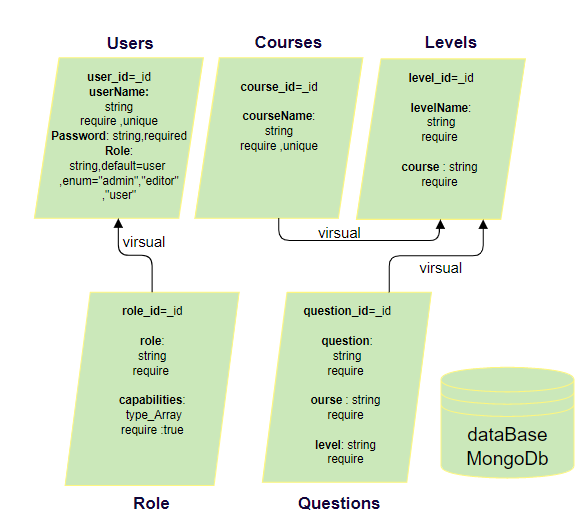

# Power Code Web Site
## OverView 
Code Academy is an educational website that provides an interactive opportunity to learn programming languages. We are committed to building your best learning experience for learning, education and creating an online learning experience for the future.
Traditional education is coupled with teaching methods that exist within schools that have not spoken of centuries ago. As a result, many companies work to "disrupt" education by changing the way things work in the classroom and by providing lessons and educational materials online. We take references from modern technology innovators in creating an engaging learning experience from what we do in the classroom.
The web application consists of a back end was written in js using Visual Studio Code and MongoDB. For testing we used Swagger. Our project talking about build application which helps users to tack courses about some languages like (Js, PHP, Python).The application has many courses and each course have many levels, each level has several question-related to the course name. The user has the ability to track the course whit different levels then answer some questions that allow him /her to know their programming capabilities.
This REST full API provides the necessary back-end infrastructure and functionality depending on the powers granted to create, read, update and delete data in our application.
**Application Repositorie**  --> (https://github.com/401-project-SGON/Code-Academy-Style-App)
**Trello** -->(https://trello.com/b/bfU2nGDB/code-academy)
## Environment Tools Used:- 
 
1. visual studio code
   * NodeJS
   * Express 
   * mongoose
   * superagent
2. Ubuntu
3. MongoDB
4. Swagger
5. Trello
6. Edraw Max-for architecture
 ***
## Current Version (0.0.1)
The current version of the power code application is designed to create, read, update and delete the questions to give users the best learning experience.
This API was designed to be extensible so that we can add multiple code language courses that supported in the future.
***
## Future Releases
 * Dynamically moving the user from the current level to the next level
 * Save user marks from previous stages
 * Dialogue sessions between users of the same programming language
 * Add exams to evaluate users
***
## Way to contribute
- leave a comment in Github
- Discuss your advice during application chat 
- Reporting Bugs: Open up an issue through this git repository and select "bug" as the label
- Recommending Enhancements: Open up an issue through this git repository and select "enhancement" as the label
- Issues are reviewed weekly
## Architecture
This API is structured on a Model View Controller(MVC) architecture pattern. The base technologies are node.js server, node.HTTP module, express middleware, and a mongo database. This architecture is currently deployed in the Heroku platform.
## Middleware:
* The express router middleware provides the base routing capability.
* A custom handle-errors module implements and extends the HTTP-errors npm middleware package.
* An auth middleware module leverages two npm modules (bcrypt, jsonwebtoken) and the module to provide user sign-up and user sign-in functionality as well as session authentication/authorization.
* Oauth, Bearer and access control middleware.
* The mongoose npm module is used for interaction with the mongo database

Individual resources (user, sign in,signup...) have dedicated dynamic models. These models are the interface between the routers and the mongo database. The dynamic model takes in a request from a route and calls it then returns a response to the route once a request has been processed in the model.
mongoose & model: The dynamic models leverage the required mongoose client module to create new schemas in the mongo database and to execute CRUD operations on mongo documents. Currently supported resources include:
- user
- editor
- admin
- courses
- levels
- questions

***
## DataBase Schema Diagram:
### ERD diagram :-
*** 

### MVP Schema Diagram :-
*** 

****
## Tree of our project 
???????????????????????????????????????????????????????????????????????????????????????????/
***
## CURD 
### Create:POST
In this route we return the all object record in our database as request body after creating the new object they will return the specific new object then this record will be added to the database.
```
function create(req,res,next){
  req.model.create(req.body).then(data=>{
    res.status(200).json(data)
  })
}
```
### Update:-PUT
This route takes the id of the user as a parameter, we will accept all records including the specific id that we need to update as a request body. after that, the single updated object record will be returned to our dataBase.  
```
function update(req,res,next){
  req.model.update(req.params.id,req.body).then(data=>{
    res.status(200).json(data)
  })
}
```
### Read / GetOne :-
In this route we take an id as parameter route then we will return a single object record from the database.
```
function getOne(req,res,next){
  req.model.get(req.params.id).then(data=>{
    res.status(200).json(data)
  })
}
```
### Read / GetAll :- 
In this route we return an object then we will return all object record from the database.
```
function getAll(req,res,next){
  req.model.get().then(data=>{
    res.status(200).json(data)
  })
}
```
### Delete :- 
In this route we will take an id for route parameter to delete spasific record,after that it will return item deleted message.
```
function deleteOne(req,res,next){
  let mesg = "item deleted"
  req.model.delete(req.params.id).then(data=>{
    res.status(200).json(mesg)
  })
}
```
## Group Members:-
***
1. Naseem Izzat: (https://github.com/naseem-qa)
2. Sohad Odtallah Al-Qtaitat: (https://github.com/sohadQtaitat)
3. Obada Quran: (https://github.com/obadeh)
4. Goroob Al-Swalqah: (https://github.com/Goorob)

